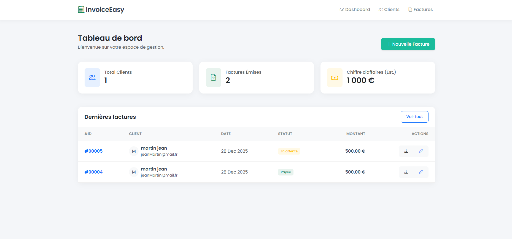
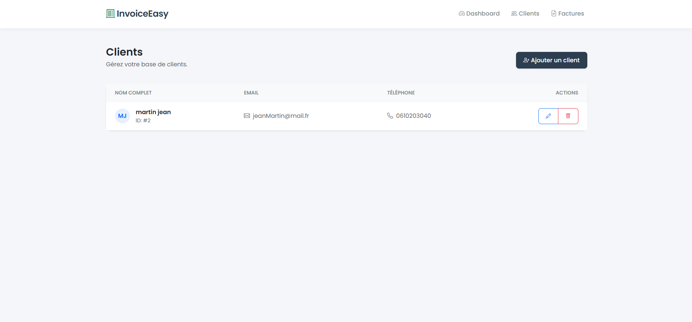
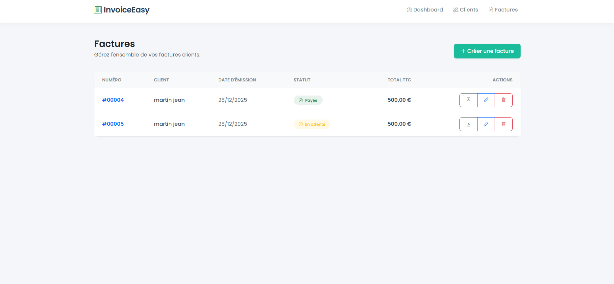
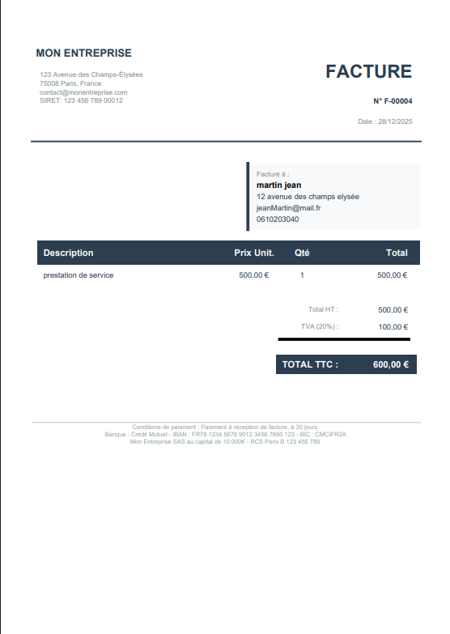

# 🚀 InvoiceEasy - Solution de Facturation Moderne
​
 > Une application de facturation élégante, rapide et professionnelle conçue pour les freelances et les PME.


​
 
 
 
 
​
 ## 🌟 À propos
​
 **InvoiceEasy** n'est pas juste un autre outil de facturation. C'est une solution complète repensée pour offrir une expérience utilisateur fluide et un rendu professionnel.
​
 L'application permet de gérer l'intégralité du cycle de facturation : de la création du client à l'exportation d'un PDF stylisé, prêt à être envoyé.
​
 ## ✨ Fonctionnalités Clés
​
 ### 🎨 Interface Utilisateur Premium
 *   **Design Moderne** : Utilisation de la police *Poppins* et d'une palette de couleurs professionnelle (Bleu Nuit & Turquoise).
 *   **Dashboard Intuitif** : Vue d'ensemble avec KPIs (Chiffre d'affaires, volume clients/factures) et graphiques visuels.
 *   **Expérience Fluide** : Animations douces, ombres portées et composants Bootstrap 5 personnalisés.
​
 ### ⚡ Gestion Dynamique
 *   **Formulaire de Facture Intelligent** : Ajout/Suppression de lignes de prestations à la volée (JavaScript pur).
 *   **Calculs Automatiques** : Totaux HT, TVA et TTC calculés en temps réel.
 *   **Gestion Clients** : Base de données clients avec avatars générés automatiquement (initiales).
​
 ### 📄 Moteur PDF Puissant
 *   **Rendu Haute Fidélité** : Génération de PDF via **TCPDF**.
 *   **Design "Flat"** : Mise en page épurée, tableau zébré, typographie soignée.
 *   **Mentions Légales** : Pied de page configurable avec IBAN et conditions de paiement.
​
 ---
​
 ## 🛠️ Stack Technique
​
 *   **Framework Backend** : Symfony 8 (Dernière version stable)
 *   **ORM** : Doctrine
 *   **Frontend** : Twig, Bootstrap 5.3, Bootstrap Icons
 *   **Scripting** : JavaScript (Vanilla)
 *   **PDF Engine** : TCPDF
 *   **Base de données** : Compatible MySQL, PostgreSQL, SQLite
​
 ---
​
 ## 🚀 Installation Rapide
​
 ### 1. Prérequis
 Assurez-vous d'avoir [PHP 8.4+](https://www.php.net/) et [Composer](https://getcomposer.org/) installés.
​
 ### 2. Installation
 Clonez le dépôt et installez les dépendances :
​
 ```bash
 git clone https://github.com/votre-username/outil-facturation.git
 cd outil-facturation
 composer install
 ```
​
 ### 3. Configuration Base de Données
 Configurez votre fichier `.env` (ou créez un `.env.local`) :
​
 ```env
 # Exemple pour SQLite (le plus simple pour tester)
 DATABASE_URL="sqlite:///%kernel.project_dir%/var/data.db"
 ```
​
 ### 4. Initialisation
 Créez la base de données et les tables :
​
 ```bash
 php bin/console doctrine:database:create
 php bin/console doctrine:schema:update --force
 ```
​
 ### 5. Lancement
 Démarrez le serveur local Symfony :
​
 ```bash
 symfony server:start
 # Ou via PHP
 php -S localhost:8000 -t public
 ```
​
 Accédez à l'application via : `http://localhost:8000`
​
 ---
​
 ## 📖 Guide d'Utilisation
​
 1.  **Tableau de Bord** : Visualisez vos statistiques dès la connexion.
 2.  **Clients** : Créez votre premier client (Nom, Email, Adresse...).
 3.  **Facturation** :
     *   Cliquez sur "Nouvelle Facture".
     *   Sélectionnez un client.
     *   Ajoutez des prestations via le bouton "+ Ajouter une ligne".
     *   Validez.
 4.  **Export** : Dans la liste des factures, cliquez sur l'icône **PDF** pour télécharger le document.
​
 ---
​
 ## ⚙️ Personnalisation
​
 Vous souhaitez changer le logo ou les couleurs du PDF ?
 Rendez-vous dans `src/Controller/FactureController.php`, méthode `pdf()` :
​
 ```php
 // Modifier les couleurs (RGB)
 $pdf->SetFillColor(44, 62, 80); // Bleu Nuit
​
 // Modifier les infos entreprise
 $html .= '<div class="company-name">VOTRE ENTREPRISE</div>';
 ```
​
 ---
​
 ## 📸 Aperçu
​
 ## Dashboard
 
​
 ## Liste des Clients
 
​
 ## Liste des Factures
 
​
 ## Facture PDF
 
​
 ---
​
